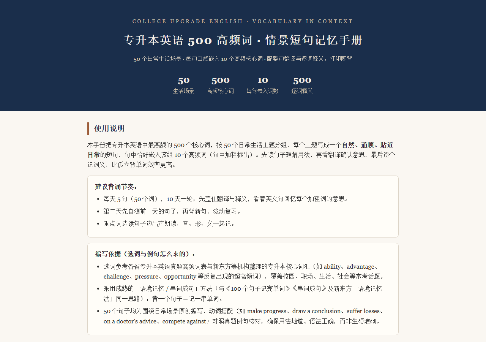
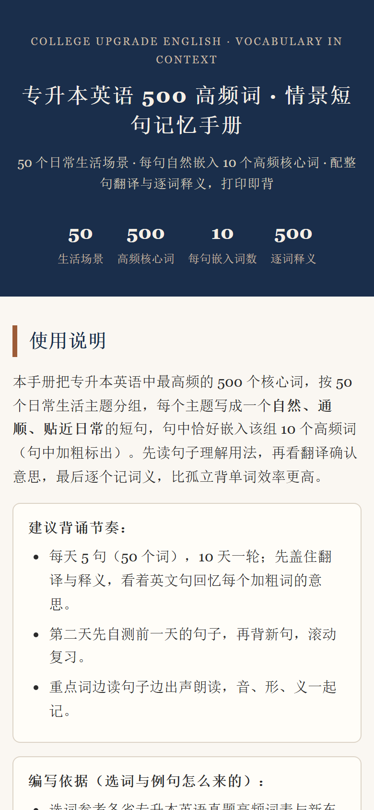

# 专升本英语 500 高频词 · 情景短句记忆手册

把专升本英语最高频的 500 个核心词，按 50 个日常生活主题写成 50 个**自然通顺**的短句，每句恰好嵌入该主题的 10 个高频词（句中加粗），配整句翻译与逐词释义，并用**预生成的神经语音**为整句和每个单词提供发音。

> 在线使用：https://words.xingxuyu.cn/ （备用：https://1745761934.github.io/zsb-500-words/ ）

## ✨ 功能

- **串词成句**：50 个场景句，每句嵌 10 个高频词，用"背一句 = 记一串词"的语境记忆法
- **真人级发音**：整句 + 500 个单词逐词发音，统一音色（Kokoro 神经语音，非浏览器自带 TTS）
- **三档语速**：慢速 / 常速（默认）/ 快速，一键循环切换，每档都预生成、切换瞬时
- **隐藏自测**：单卡隐藏译文 + 一键背诵模式（隐藏全部翻译与释义），互不干扰
- **手机适配**：320–430px 无横向溢出、刘海屏安全区、喇叭按钮触控友好、打印自动隐藏按钮

## 📸 截图

| 桌面端 | 手机端 |
|---|---|
|  |  |

## 📖 使用方法

- 点「朗读整句」听整句；点单词旁的小喇叭听单词；再点一次停止。
- 点每张卡片右上角「隐藏译文」单独遮挡该句的翻译与释义；顶部「一键进入背诵模式」隐藏全部。
- 顶部「语速」按钮在慢速 / 常速 / 快速之间循环。

建议节奏：每天 5 句（50 词），10 天一轮；先盖住翻译回忆加粗词，再出声朗读，音、形、义一起记。

## 🎙 发音是怎么做的

- 音色：**Kokoro-82M（af_heart，Apache-2.0）** 本地推理，全站同一把声音，不依赖访客设备音色。
- 后期：30ms 前导保留自然起振 → 12ms 淡入 / 25ms 淡出 → 门限 RMS 响度归一 → 峰值限制。
- 编码：MP3，**44.1kHz / 96kbps 单声道**，无 ID3 头（避免部分移动端短音频开头杂音）。
- 音频按需加载；播放器内置三级降级（直连 → Blob 重建 → 系统语音），降级会**显式标记**，不静默换声。

## 🗂 目录结构

```
index.html          单文件站点（样式/脚本/内容全部内联，可直接静态部署）
audio-v7/           预生成发音（s/n/f 三档 × 整句 s01–s50 + 单词 w/*.mp3）
data/words.json     500 词表
data/sentences.json 50 句原文
scripts/gen_audio.py      全量音频生成脚本（Kokoro → 后期 → MP3）
scripts/patch_audio.py    局部重新生成示例（改词/改句后补音频）
docs/screenshots/   预览截图
```

## 🚀 本地运行 / 重新生成音频

**直接预览**：`index.html` 是单文件，但音频在 `audio-v7/`，直接双击打开会退回系统语音。完整效果请用任意静态服务器：

```bash
python -m http.server 8899   # 然后打开 http://127.0.0.1:8899/
```

**重新生成音频**（需要 Python 3.10 + `kokoro_onnx` + `onnxruntime` + `ffmpeg`，以及 Kokoro 模型）：

```bash
# 模型文件 kokoro-v1.0.onnx / voices-v1.0.bin 放在 work/kokoro/ 下
python scripts/gen_audio.py run n s f     # 全量三档
```

## 📚 选词与例句依据

- 选词参考各省专升本英语真题高频词表，及新东方等机构整理的专升本核心词汇。
- 采用成熟的「语境记忆 / 串词成句」方法（与《100 个句子记完单词》《串词成句》、新东方「语境记忆法」同思路）。
- 50 个句子均为围绕日常场景**原创编写**，动词搭配对照真题例句核对，确保用法地道。

## 📄 License

代码 [MIT](LICENSE)；词表与例句为原创内容，可在注明来源的前提下引用。

## ⚠️ 说明

本项目为静态站点，无后端、无登录、无数据采集。
